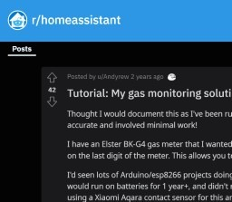

# gascounter-zigbee
### **Zigbee Gaszähler m³/kWh**



### **Der Gedanke ...**

Mit der Möglichkeit in Homeassistant Energieverbrauch darzustellen wollte ich einen lange gehegten Wunsch des Zählens von Gasmengen zu ermöglichen und darzustellen.

### **Wie immer, das Internet hilft**


**Historie**

Vor ca. 10 Jahren hatte ich schon einmal eine Lösung von ELV versucht mit einem optischen Augen. Damals scheiterte es aber an sinnvoller Darstellung der CSV Daten, was recht mühsam war. Eine Funkstation mit Datensammler, den man alle Woche auslesen musste, machte keine Freude. Wobei der optische Zahlenwechsel sicher schon gut funktionierte.

**Internetsuche letztlich mit Erfolg**

Zugegebener Massen habe ich dazu vor ca. 2-3 Jahren im Internet gesucht und nichts gescheites gefunden. Vielleicht war die Suche nicht ernsthaft genug. Dann fand ich den Link im Reddit [Tutorial: My gas monitoring solution with Home Assistant and Zigbee](https://www.reddit.com/r/homeassistant/comments/eno3jn/tutorial_my_gas_monitoring_solution_with_home/) von "u/Andyrew". Perfekt, einige Homeassistant Scripte und Links zu STL Files sind darin enthalten.

### Die Idee


**Ein guter Gedanke**

Beim Lesen des Reddit Eintrags und nach Ansicht der STL Modelle kam mir ganz schnell eine Idee.

_Moment, du hast doch noch einige Tür/Fensterkontakte in der Schublade, die haben doch sicher Reed-Relais, da diese auf Magnete reagieren._

### Beta Test


Schnell war ein Türkontakt demontiert und mit doppelseitigem Klebeband in die Mulde des Gaszähler platziert.

Zu meiner Überraschung funktionierte es so schon einwandfrei, ich konnte die Ticks im Homeassistant mit dem Zählerstand über eine Stunde vergleichen, passt.

### Code anpassen


**Dank an u/Andyrew**

An dieser Stelle nochmals allerbesten Dank an "u/Andyrew" für den übersichtlichen Reddit Eintrag.

**Running System**

Der Vollständigkeit halber hier der bei mir laufende Code, abgelegt in externen Links.

* [Inputs](https://pastecode.io/s/i3we3fi6)
* [Sensor kWh und Gas Preis Berechnung](https://pastecode.io/s/619eyrw4)
* [Utility Meters](https://pastecode.io/s/z8iqohp9)
* [Automations](https://pastecode.io/s/kop9ajd0)
* [Dashboard Card](https://pastecode.io/s/q45htigf)

Screenshot zum Dashboard.


In die angezeigten Input Felder trägt man lediglich den Gaspreis in Cent und den durchschnittlichen Tagespreis einer Grundgebühr ein.


Mit den Homeassistant Energie Dashboard kann man z.B. den stündlichen Gasverbrauch aus dem Utility Meter gas_hourly darstellen.

**Diskussion zur Formel Preisberechnung**

Im Reddit Eintrag bezieht sich die Formel auf den britischen Gastarif, das passt hier nicht so ganz.

In Deutschland hat man eben den Cent Betrag je kWh und eine monatliche Grundgebühr.

Zusätzlich müssen die m³ mit einem sich ändernden Brennwert multipliziert werden, diesen kann man nur schätzen. Aus meiner Erfahrung ändert der sich aber wenn, dann in der zweiten Nachkommastelle.

Auch ist es ggf. fragwürdig einen monatlichen Grundbetrag umzubrechen auf den Tag, die Stunde oder sogar die Viertelstunde, Naja ...

**Formel Beispiel**

Siehe auch Links in Seite "Code anpassen"

**_Quellcode m³ addieren_**

```yaml
service: input_number.set_value
data_template:
entity_id: input_number.gas_meter_m3
value: '{{ (states.input_number.gas_meter_m3.state | float ) + 0.010 }}'
```

**_Quellcode Brennwert berechnen_**

    gas_meter_kwh:
    device_class: gas
    unit_of_measurement: "kWh"
    value_template: "{{ states.input_number.gas_meter_m3.state | float * 9.5 }}"

**_Quellcode zeitliche Berechnung_**

    gas_price_hour:
    unit_of_measurement: "€"
    value_template: "{{ (((states.sensor.gas_hourly.state | float * (states.input_number.energy_gas_unit.state | float /100) ) + (states.input_number.energy_gas_standing.state | float /24)) ) | round(2) }}"

**Werte Bedeutung**

* `{{ (states.input_number.gas_meter_m3.state | float ) + 0.010 }}` = Eine Drehung Zählerscheibe ist 0,01 m³
* `{{ states.input_number.gas_meter_m3.state| float * 9.5 }}` = gezählte m³ ca. in kWh umrechnen
* `states.sensor.gas_hourly.state | float` = Stündlicher Wert kWh
* `(states.input_number.energy_gas_unit.state | float /100)` = Cent Wert normiert auf EUR
* `(states.input_number.energy_gas_standing.state | float /24)` = Tägliche Grundgebühr / 24h

### 3D Druck für Türkontakt


**STL File anpassen**

Basierend auf dem Link in dem Reddit Eintrag von u/Andyrew musste dieser nur noch so angepasst werden, dass eben der kleine Türkontakt MCCGQ01LM genau unter die Scheibe mit dem Magnet passt.

**Türkontakt anpassen**

Man muss die Platine des etwas kürzen an der Seite mit der Antenne bis kurz vor die Antenne. Dann passt es genau in den 3D Druck und dieser an den Gaszähler. Allerdings, das habe ich etwas schnell in Tinkercad konstruiert, hier ist bestimmt noch Potential zur Verbesserung.

Der Link zur STL Datei mit Bezug auf die Urform ist hier [BK-G4 Gas Sensor Count with Door Sensor MCCGQ01LM](https://www.thingiverse.com/thing:5078865)

### Nice and easy


**Preiswert**

Für vielleicht 10-15 EUR erhält man einen hoch präzisen Gaszähler.

Voraussetzung: Homeassistant mit Zigbee2mqtt
