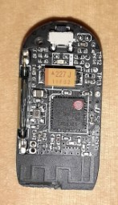
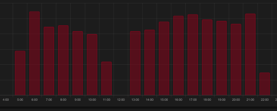

# gascounter-zigbee
Voraussetzung: Homeassistant mit Zigbee2mqtt
Thanks to **u/Andyrew**

## **Zigbee Gaszähler m³/kWh**


### **The idea ...**
With the possibility to display energy consumption in Homeassistant, I wanted to enable and display a long-held desire of counting gas quantities.

### **As always, the Internet helps**


**History**
About 10 years ago I had already tried a solution from ELV with an optical eye. At that time, however, it failed to meaningful representation of the CSV data, which was quite tedious. A radio station with data collector, which one had to read out every week, made no joy. Whereby the optical number change certainly already worked well.

**Internet search ultimately with success**.
Admitted masses I have searched for this about 2-3 years ago on the Internet and found nothing clever. Maybe the search was not serious enough. Then I found the link in Reddit [Tutorial: My gas monitoring solution with Home Assistant and Zigbee](https://www.reddit.com/r/homeassistant/comments/eno3jn/tutorial_my_gas_monitoring_solution_with_home/) from "u/Andyrew". Perfect, some Homeassistant scripts and links to STL files are included.

### The Idea


**A good thought**

While reading the Reddit entry and after looking at the STL models, an idea came to me very quickly.

_Wait a minute, you still have some door/window contacts in the drawer, surely they have reed relays since they respond to magnets._

### Beta Test


Quickly a door contact was dismantled and placed with double-sided tape in the trough of the gas meter.

To my surprise, it already worked perfectly, I could compare the ticks in the Homeassistant with the meter reading over an hour, fits.

### Some Codeing


**Great thanks to u/Andyrew**

Thanks again to "u/Andyrew" for the clear Reddit entry.

**Running System**

For the sake of completeness, here is the code I have running, stored in files in this git.

* [Inputs](inputs.yaml)
* [Sensor kWh und Gas Preis Berechnung](calc-kwh-price.yaml)
* [Utility Meters](utility-meters.yaml)
* [Automations](gas-pulse.yaml)
* [Dashboard Card](gas-dashboard-card.yaml)

Screenshot Dashboard.


In the input fields displayed, one simply enters the gas price in cents and the average daily price of a basic charge.



With the Homeassistant energy dashboard, for example, you can display the hourly gas consumption from the Utility Meter gas_hourly.

**Discussion about the formula price calculation**.

In the Reddit entry, the formula refers to the British gas tariff, which does not quite fit here.

In Germany you just have the cent amount per kWh and a monthly base fee.

In addition, the m³ must be multiplied by a changing calorific value, which can only be estimated or read from the pricelists. From my experience, however, it changes in the second decimal place.

Also, it may be questionable to convert a monthly base amount to the day, the hour or even the quarter hour, Well ...

**Formula example**
Look at the files in this git.

**_Code m³ add_**
```yaml
service: input_number.set_value
data_template:
entity_id: input_number.gas_meter_m3
value: '{{ (states.input_number.gas_meter_m3.state | float ) + 0.010 }}'
```

**_Calculate calorific value code_**
```yaml
gas_meter_kwh:
device_class: gas
unit_of_measurement: "kWh"
value_template: "{{ states.input_number.gas_meter_m3.state | float * 9.5 }}"
```

**_source code temporal calculation_**
```yaml
gas_price_hour:
unit_of_measurement: "€"
value_template: "{{ (((states.sensor.gas_hourly.state | float * (states.input_number.energy_gas_unit.state | float /100) ) + (states.input_number.energy_gas_standing.state | float /24)) ) | round(2) }}"
```

**Values Meaning**

* `{{ (states.input_number.gas_meter_m3.state | float ) + 0.010 }}` = One rotation of last counter disc is 0.01 m³
* `{{ states.input_number.gas_meter_m3.state| float * 9.5 }}` = Convert counted m³ approx. to kWh
* `states.sensor.gas_hourly.state | float` = Hourly value kWh
* `(states.input_number.energy_gas_unit.state | float /100)` = Cent value normalized to EUR
* `(states.input_number.energy_gas_standing.state | float /24)` = Daily base fee / 24h

### 3D Print for Doorcontact


**Adapt the STL file**.

Based on the link in u/Andyrew's Reddit entry, this just needed to be adjusted so that just the small door contact MCCGQ01LM fits exactly under the gas counter disk with the magnet.

**Adapt door contact**

You have to shorten the board a little bit on the side with the antenna until just before the antenna. Then it fits exactly into the 3D print and this to the gas meter. However, I have constructed this somewhat quickly in Tinkercad, here is certainly still potential for improvement.

The link to the STL file with reference to the original shape is here [BK-G4 Gas Sensor Count with Door Sensor MCCGQ01LM](https://www.thingiverse.com/thing:5078865)

### Nice and easy


**Value for money**

For maybe 10-15 EUR you get a highly accurate gas meter.
